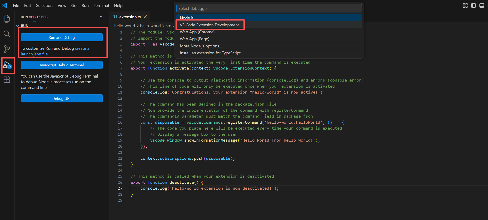
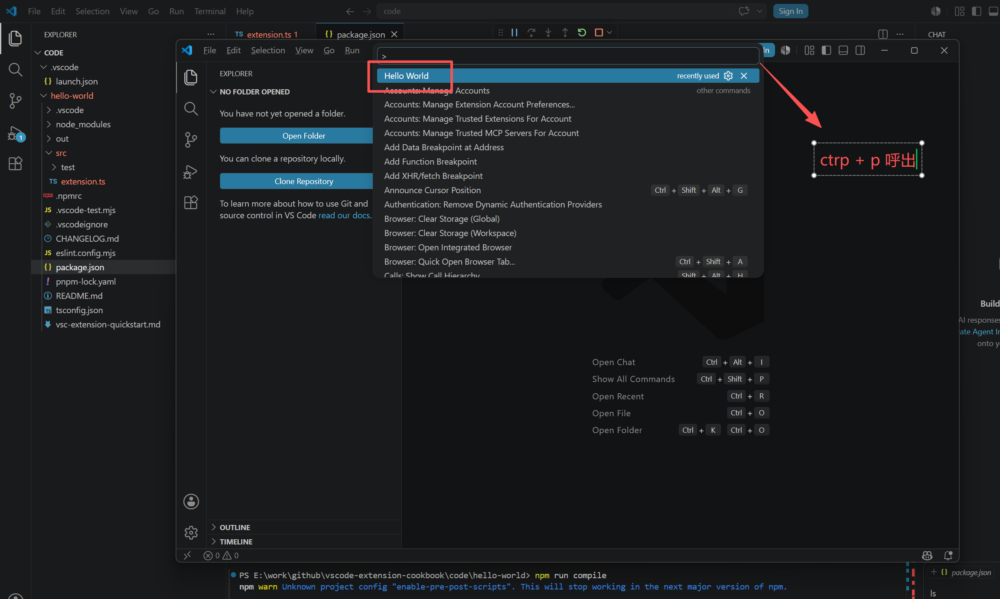
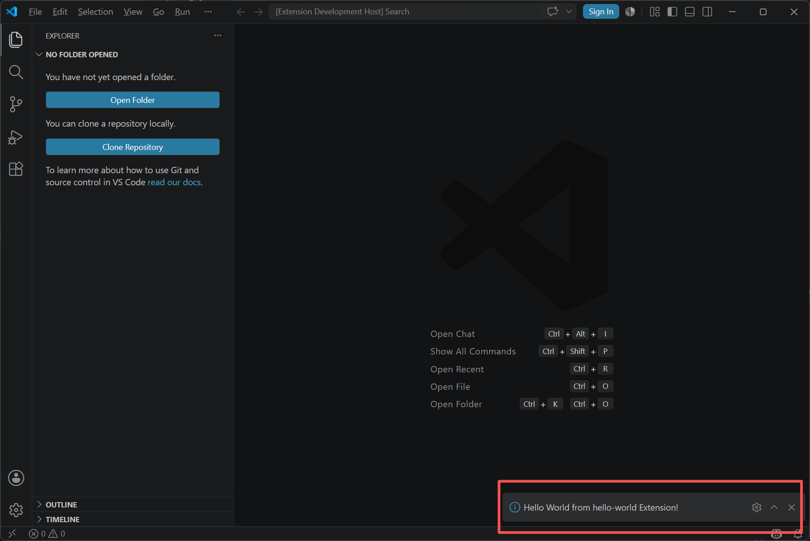
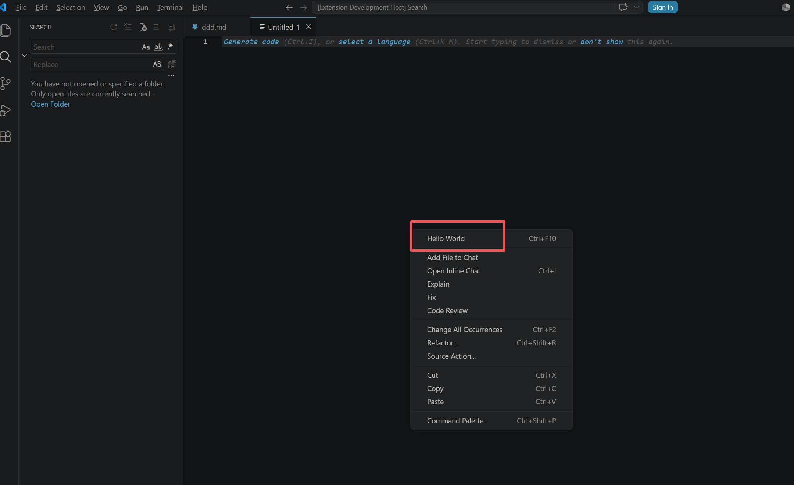
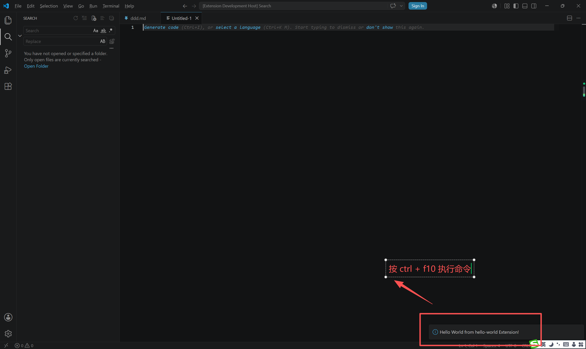
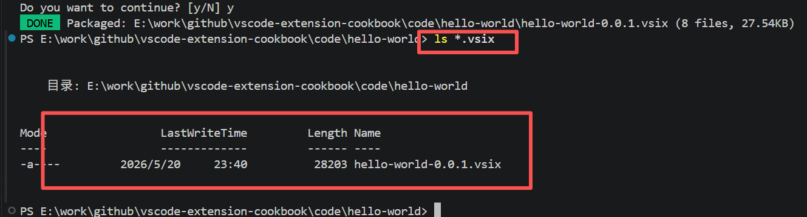

# 第一个 Hello World 扩展

## 安装脚手架工具
```bash
npm install --global yo generator-code
```

## 初始化项目
```bash
yo code
```
按提示选择
```bash

     _-----_     ╭──────────────────────────╮
    |       |    │   Welcome to the Visual  │
    |--(o)--|    │   Studio Code Extension  │
   `---------´   │        generator!        │
    ( _´U`_ )    ╰──────────────────────────╯
    /___A___\   /
     |  ~  |     
   __'.___.'__   
 ´   `  |° ´ Y ` 

`list` prompt is deprecated. Use `select` prompt instead.
✔ What type of extension do you want to create? New Extension (TypeScript)
✔ What's the name of your extension? hello world
✔ What's the identifier of your extension? hello-world
✔ What's the description of your extension? hello world demo
✔ Initialize a git repository? No
`list` prompt is deprecated. Use `select` prompt instead.
✔ Which bundler to use? unbundled
`list` prompt is deprecated. Use `select` prompt instead.
✔ Which package manager to use? pnpm
```

## 目录结构
```bash
.
└── hello-world
    ├── CHANGELOG.md
    ├── README.md
    ├── eslint.config.mjs
    ├── node_modules
    ├── out                             Typescript 编译输出目录
    ├── package.json                    vscode 扩展配置文件
    ├── pnpm-lock.yaml
    ├── src
    │   ├── extension.ts                vscode 扩展入口文件 由 package.json 中的 main 字段指定
    │   └── test
    │       └── extension.test.ts
    ├── tsconfig.json
    └── vsc-extension-quickstart.md

```

## package.json (只展示和扩展配置相关的内容)
```json
{
	// 扩展的激活事件
	"activationEvents": [
		"onCommand:demo1.helloWorld"
	],
	// 入口文件
	"main": "./out/extension.js",
	// 贡献点，vscode插件大部分功能配置都在这里
	"contributes": {
		"commands": [
			{
				"command": "demo1.helloWorld",
				"title": "Hello World"
			}
		]
	}
}
```

## extension.ts
```typescript
import * as vscode from 'vscode';

// 扩展激活时调用
export function activate(context: vscode.ExtensionContext) {
	console.log('Congratulations, your extension "hello-world" is now active!');
    // 注册命令  命令 ID 必须与 package.json 中的命令 ID 匹配
	const disposable = vscode.commands.registerCommand('demo1.helloWorld', () => {
        // 显示信息消息
		vscode.window.showInformationMessage('Hello World from hello-world!');
	});
	context.subscriptions.push(disposable);
}

// 扩展停用时调用
export function deactivate() {
    console.log('hello-world extension is now deactivated!');
}
```

## 编译代码 (如果是 TypeScript 项目 需要先编译)
```bash
cd ./hello-world
pnpm run compile
```

## 运行调试


## 验证



## 添加右键菜单和快捷键
package.json 中编辑 contributes, 配置右键菜单和快捷键
```json
{
	"contributes": {
		"commands": [
			{
				"command": "demo1.sayHello",
				"title": "Hello World"
			}
		],
		// 快捷键绑定
		"keybindings": [
			{
				"command": "demo1.sayHello",
				"key": "ctrl+f10",
				"mac": "cmd+f10",
				"when": "editorTextFocus"
			}
		],
		// 设置菜单
		"menus": {
			"editor/context": [
				{
					"when": "editorFocus",
					"command": "demo1.sayHello",
					"group": "navigation"
				}
			]
		}
	}
}
```
## 验证



## 打包
### 安装打包工具
```bash
npm i vsce -g
```

### 将扩张打包成.vsix文件
```bash
vsce package
```

### 验证打包结果
```bash
ls *.vsix
```


## 项目代码
> https://github.com/freewu/vscode-extension-cookbook/tree/main/code/hello-world

## 资料
```
https://code.visualstudio.com/api/get-started/your-first-extension
https://blog.haoji.me/vscode-plugin-hello-world.html
```