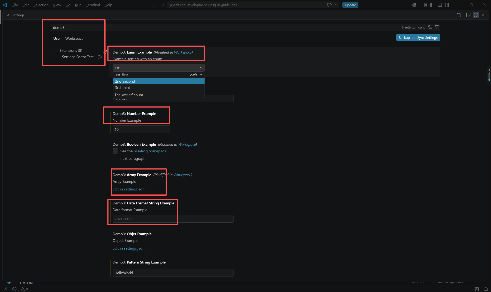
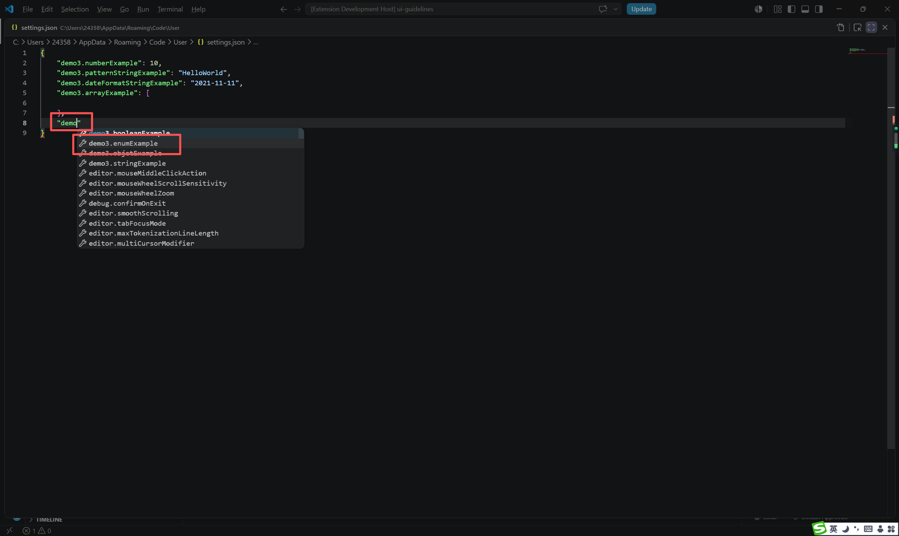
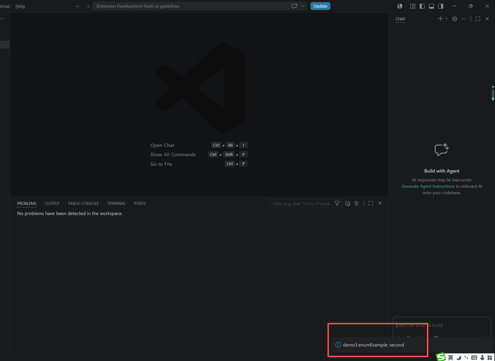

# 扩展配置
> 一些将对用户可见的设置。用户可以在设置编辑器中设置这些配置选项，也可以直接编辑 settings.json 文件
## package.json 配置
```json
{
  "contributes": {
    "commands": [
      {
        "command": "settings-demo.get.enumExample",
        "title": "Demo3 get enumExample"
      }
    ],
    "configuration": {
      "title": "Settings Editor Test Extension",
      "type": "object",
      "properties": {
        "demo3.booleanExample": {
          "type": "boolean",
          "default": true,
          "description": "Boolean Example",
          "order": 3,
          "markdownDescription": "See the [bluefrog homepage](https://freewu.github.io/) \n\n next paragraph"
        },
        "demo3.stringExample": {
          "type": "string",
          "default": "bluefrog",
          "order": 0,
          "description": "String Example",
          "maxLength": 100,
          "minLength": 5
        },
        "demo3.numberExample": {
          "type": "number",
          "default": 100,
          "order": 1,
          "description": "Number Example",
          "minimum": 0,
          "maximum": 1000
        },
        "demo3.enumExample": {
          "type": "string",
          "enum": ["first", "second", "third"],
          "markdownEnumDescriptions": [
            "The *first* enum",
            "The *second* enum",
            "The *third* enum"
          ],
          "order": 0,
          "enumItemLabels": ["1st", "2nd", "3rd"],
          "default": "first",
          "description": "Example setting with an enum"
        },
        "demo3.arrayExample": {
          "type": "array",
          "default": [],
          "description": "Array Example"
        },
        "demo3.objetExample": {
          "type": "object",
          "default": {},
          "description": "Object Example"
        },
        "demo3.deprecatedExample": {
          "type": "string",
          "default": "Deprecated property",
          "description": "Deprecated Example",
          "markdownDeprecationMessage": "**Deprecated**: This property is deprecated. Please use the new property instead."
        },
        "demo3.patternStringExample": {
          "type": "string",
          "default": "Hello World",
          "pattern": "^[a-zA-Z0-9_]+$",
          "patternErrorMessage": "Only letters, numbers, and underscores are allowed"
        },
        "demo3.dateFormatStringExample": {
            "type": "string",
            "default": "2023-01-01",
            "format": "date",
            "description": "Date format Example"
        },
        "demo3.multilineTextExample": {
            "type": "string",
            "default": "multilineText\n\nbluefrog\n\n",
            "editPresentation": "multilineText"
        }
      }
    }
  }
}
```

## Property Schema 说明
### description 描述
> 如果存在 markdownDescription 属性，则 description 属性将被忽略。
```json
{
     "configuration": {
            "properties": {
                "demo3.propertyExample": { // 
                    "description": "Description of the property"  // 属性描述
                },
            }
     }
}
```

### markdownDescription 支持 Markdown 格式的描述
```json
{
     "configuration": {
            "properties": {
                "demo3.propertyExample": { // 
                    "markdownDescription": "See the [bluefrog homepage](https://freewu.github.io/) \n\n next paragraph"  //  支持 Markdown 格式的属性描述
                },
            }
     }
}
```
* 要 markdownDescription 添加换行符或多个段落，请使用字符串\n\n分隔段落
> 使用以下特殊语法在 Markdown 类型的属性中插入指向其他设置的链接，该链接将在设置界面中显示为可点击的链接：`#target.setting.id#`

### type 类型
```json
{
     "configuration": {
            "properties": {
                "demo3.propertyExample": { // 
                    "type": "string"  //  属性值类型 支持格式: number, string, boolean, object, array
                },
            }
     }
}
```

### order 排序
```json
{
     "configuration": {
            "properties": {
                "demo3.propertyExample": { // 
                    "order": 100  //  属性排序
                },
            }
     }
}
```
* 可以采用整数 order 类型的属性，该属性指示它们相对于其他类别和/或设置的排序方式。
* 如果两个类别都具有 order 属性，则序号较小的类别排在前面。如果某个类别没有被赋予order属性，则它出现在被赋予该属性的类别之后。
* 如果同一类别下的两个设置项都具有 order 属性，则序号较小的设置项排在前面。如果同一类别下的另一个设置项没有属性 order，则它将排在已赋予该属性的设置项之后。
* 如果两个类别具有相同的 order 属性值，或者同一类别中的两个设置具有相同的 order 属性值，则它们将在设置界面中按字典序递增排序

### enum 枚举属性
> enum / enumDescriptions / markdownEnumDescriptions / enumItemLabels
```json
{
     "configuration": {
            "properties": {
                "demo3.propertyExample": { // 
                    "enum": ["first", "second", "third"],
                    "markdownEnumDescriptions": [ // 一个长度与该属性相同的字符串数组 enum。该 enumDescriptions 属性会在设置界面的下拉菜单底部为每个 enum 项目提供描述
                        "The *first* enum",
                        "The *second* enum",
                        "The *third* enum"
                    ],
                    "enumItemLabels": ["1st", "2nd", "3rd"], // 自定义设置界面中的下拉选项名称
                    "default": "first",
                    "description": "Example setting with an enum"
                },
            }
     }
}
```

### deprecationMessage 属性弃用消息
> 则该设置将带有您指定信息的警告下划线
```json
{
     "configuration": {
            "properties": {
                "demo3.propertyExample": { // 
                    "deprecationMessage": "This property is deprecated. Please use the new property instead."  // 属性弃用提示消息
                },
            }
     }
}
```

### markdownDeprecationMessage 属性弃用消息
> 则该设置将带有您指定信息的警告下划线
```json
{
     "configuration": {
            "properties": {
                "demo3.propertyExample": { // 
                    "markdownDeprecationMessage": "**Deprecated**: This property is deprecated. Please use the new property instead."  //  支持 Markdown 格式的属性弃用提示消息
                },
            }
     }
}
```
> 使用以下特殊语法在 Markdown 类型的属性中插入指向其他设置的链接，该链接将在设置界面中显示为可点击的链接：`#target.setting.id#`


### default 默认值
> 定义属性的默认值，根据属性类型不同，默认值类型也不同
```json
{
    "configuration": {
        "properties": {
            "demo3.propertyStringExample": { // 
                "type": "string",
                "default": "Hello World"  //  默认值
            },
            "demo3.propertyNumberExample": { // 
                "type": "number",
                "default": 100  //  默认值
            },
            "demo3.propertyBooleanExample": { // 
                "type": "boolean",
                "default": true  //  默认值
            }
        }
    }
}
```

### minimum maximum 限制数值
> 定义数值的最小和最大值，type 为 number 时生效
```json
{
    "configuration": {
        "properties": {
            "demo3.propertyNumberExample": { // 
                "type": "number",
                "default": 100,
                "minimum": 0,
                "maximum": 1000
            }
        }
    }
}
```
### maxLength minLength 限制字符串长度
> 定义字符串的最小和最大长度，type 为 string 时生效
```json
{
    "configuration": {
        "properties": {
            "demo3.propertyStringExample": { // 
                "type": "string",
                "default": "Hello World",
                "maxLength": 100,
                "minLength": 10
            }
        }
    }
}
```

### pattern 用于将字符串限制为给定的正则表达式
> 定义字符串是否必须匹配给定的正则表达式，type 为 string 时生效
```json
{
    "configuration": {
        "properties": {
            "demo3.propertyStringExample": { // 
                "type": "string",
                "default": "Hello World",
                "pattern": "^[a-zA-Z0-9_]+$",
                "patternErrorMessage": "Only letters, numbers, and underscores are allowed"
            }
        }
    }
}
```

### patternErrorMessage 用于在模式不匹配时给出定制的错误消息。
> 定义字符串是否必须匹配给定的正则表达式，type 为 string 时生效
```json
{
    "configuration": {
        "properties": {
            "demo3.propertyStringExample": { // 
                "type": "string",
                "default": "Hello World",
                "pattern": "^[a-zA-Z0-9_]+$", // 设置的属性需要匹配正则表达式
                "patternErrorMessage": "Only letters, numbers, and underscores are allowed" // 在模式不匹配时给出定制的错误消息
            }
        }
    }
}
```
### format 
> 用于将字符串限制为众所周知的格式，例如: date, time, ipv4, email, uri
```json
{
    "configuration": {
        "properties": {
            "demo3.propertyDateStringExample": {
                "type": "string",
                "default": "2023-01-01",
                "format": "date"   // date, time, ipv4, email, uri
            },
            "demo3.propertyTimeStringExample": {
                "type": "string",
                "default": "12:01:01Z",
                "format": "time"   // date, time, ipv4, email, uri
            },
            "demo3.propertyIpStringExample": {
                "type": "string",
                "default": "10.1.0.1.1",
                "format": "ipv4"   // date, time, ipv4, email, uri
            },
            "demo3.propertyMailStringExample": {
                "type": "string",
                "default": "user@example.com",
                "format": "email"   // date, time, ipv4, email, uri
            },
            "demo3.propertyUrlStringExample": {
                "type": "string",
                "default": "https://freewu.github.io/",
                "format": "uri"   // date, time, ipv4, email, uri
            }
        }
    }
}
```
### maxItems minItems 限制数组长度
> 定义数组的最小和最大长度，type 为 array 时生效
```json
{
    "configuration": {
        "properties": {
            "demo3.propertyArrayExample": {
                "type": "array",
                "default": [1, 2, 3],
                "maxItems": 3,
                "minItems": 1
            }
        }
    }
}
```

### editPresentation 用于控制在“设置”编辑器中，字符串设置项是呈现单行输入框还是多行文本区域。
> 定义字符串设置项是呈现单行输入框还是多行文本区域。
```json
{
    "configuration": {
        "properties": {
            "demo3.propertyStringExample": { // 
                "type": "string",
                "default": "Hello World",
                "editPresentation": "multilineText"  //  多行文本区域, 不设置默认值时为单行输入框
            }
        }
    }
}
```

### scope 作用域
> 如果未scope声明，则默认值为window。
```json
{
    "configuration": {
        "properties": {
            "demo3.propertyExample": { // 
                "scope": "workspace"  //  作用域
            },
            "demo3.propertyExample2": { // 
                "scope": "global"  //  作用域
            },
            "demo3.propertyExample3": { // 
                "scope": "user"  //  作用域
            }
        }
    }
}
```
值类型:
```markdown
application              适用于所有 VS Code 实例且只能在用户设置中配置的设置。
machine                  只能在用户设置或远程设置中设置的机器特定设置。例如，不应在不同机器间共享的安装路径。这些设置的值将不会同步。
machine-overridable      这些是机器特定的设置，可能会被工作区或文件夹设置覆盖。这些设置的值不会同步。
window                   Windows（实例）特定设置，可在用户、工作区或远程设置中进行配置。
resource                 资源设置，适用于文件和文件夹，可以在所有设置级别（甚至文件夹设置）中进行配置。
language-overridable     可在语言级别进行覆盖的资源设置
```

### ignoreSync 忽略同步到用户设置
> 设置`true`ignoreSync来true阻止该设置与用户设置同步。这对于非用户特定的设置非常有用。
> 例如，该remoteTunnelAccess.machineName设置并非用户特定的，因此不应同步。
> 请注意，如果您已将 作用域 `scope` 设置为 `machine` `machine-overridable` 则无论 `false` 的值如何，该设置都不会同步ignoreSync
```json
{
    "configuration": {
        "properties": {
            "demo3.propertyStringExample": { // 
                "type": "string",
                "default": "Hello World",
                "ignoreSync": true  // 忽略同步到用户设置
            }
        }
    }
}
```

## 获取配置值
```typescript
{
    const booleanExample = vscode.workspace.getConfiguration().get('demo3.booleanExample');
    const stringExample = vscode.workspace.getConfiguration().get('demo3.stringExample');
    const numberExample = vscode.workspace.getConfiguration().get('demo3.numberExample');
    const enumExample = vscode.workspace.getConfiguration().get('demo3.enumExample');
}
```

## 设置配置值
```typescript
// 最后一个参数，为 true 时表示写入全局配置，为 false 或不传时则只写入工作区配置
vscode.workspace.getConfiguration().update('demo3.stringExample', 'bluefrog', true);
```

## 配置值变更事件
```typescript
context.subscriptions.push(vscode.workspace.onDidChangeConfiguration((e) => {
	console.log('配置发生变化！', e);
}));
```

## 验证




## 项目代码
> https://github.com/freewu/vscode-extension-cookbook/tree/main/code/settings-demo


## 资料
```
https://code.visualstudio.com/api/references/contribution-points#contributes.configuration
https://blog.haoji.me/vscode-plugin-snippets-and-settings.html
```