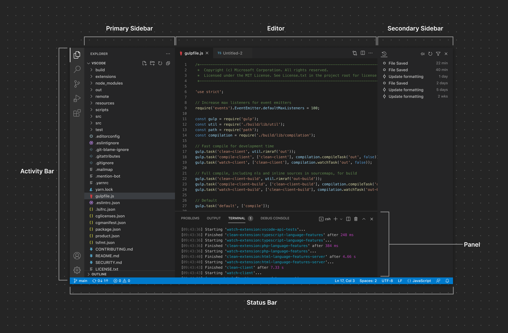
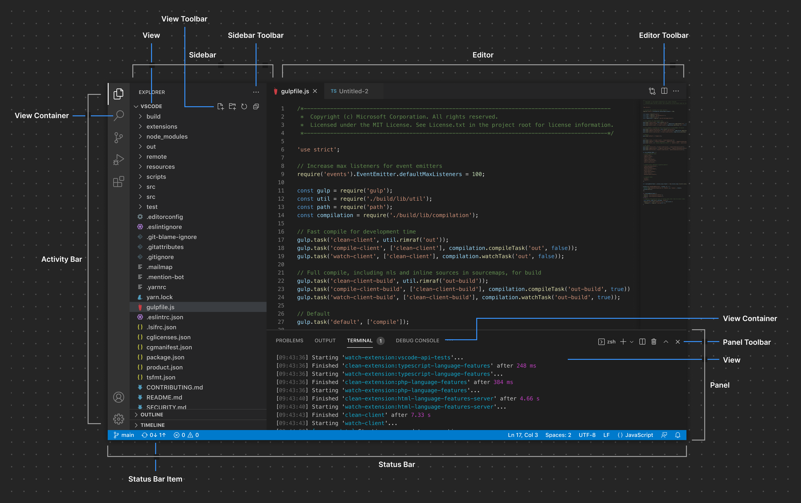
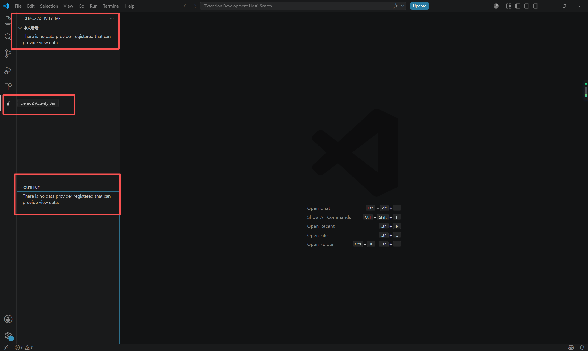
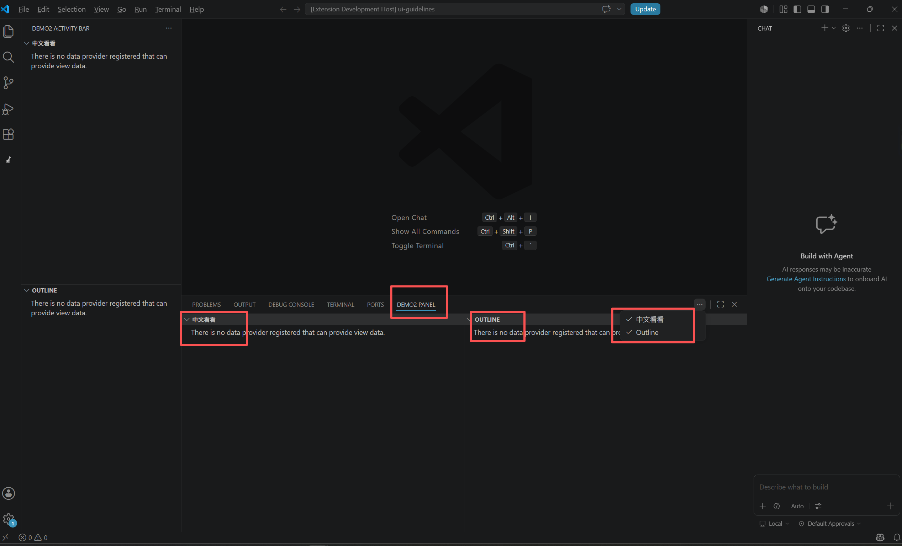
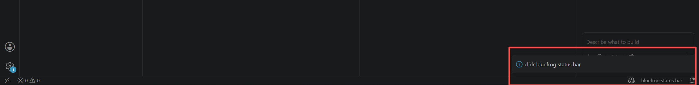

# VScode UI 介绍

## 容器说明




## 活动栏 Activity Bar
### package.json 配置
```json
{
    "contributes": {
        "viewsContainers": {
            "activitybar": [ // 在 Activity Bar 新增一个按钮
                {
                    "id": "demo2",       // 视图容器指定标识符
                    "title": "Demo2 Activity Bar",    // 图容器指定标标题
                    "icon": "resources/icon.svg" // 图容器指定标识符图标 大小 24x24  / 单色  / .svg 格式
                }
            ]
        },
        "views": {
            "demo2": [ // 
                {
                    "id": "demo2-dependencies",
                    "name": "中文看看"
                },
                {
                    "id": "demo2-outline",
                    "name": "Outline"
                }
            ]
        }
    }
}
```
> https://code.visualstudio.com/api/references/contribution-points#contributes.viewsContainers

默认的 Activity Bar 按钮ID：
```
explorer: Explorer view in the Side Bar
debug: Run and Debug view in the Side Bar
scm: Source Control view in the Side Bar
test: Test explorer view in the Side Bar
```

### 效果验证


### 资料
```
https://code.visualstudio.com/api/ux-guidelines/overview
https://code.visualstudio.com/api/references/contribution-points#contributes.viewsContainers
https://code.visualstudio.com/api/references/contribution-points#contributes.views
```

## 侧边栏 Sidebars 

> 主侧边栏和辅助侧边栏由一个或多个视图容器提供的视图组成

### 主侧边栏 Primary Sidebar

### 辅助侧边 Secondary Sidebar

## 面板 Panel
### package.json 配置
```json
{
    "contributes": {
        "viewsContainers": {
            "panel": [ // 在 Panel 新增一个区域
                {
                    "id": "demo2-panel",          // 视图容器指定标识符
                    "title": "Demo2 Panel",       // 视图容器指定标标题
                    "icon": "resources/icon.svg"  // 图容器指定标识符图标 大小 24x24  / 单色  / .svg 格式
                }
            ]
        },
        "views": {
            "demo2-panel": [ // 
                {
                    "id": "demo2-panel-dependencies",
                    "name": "中文看看"
                },
                {
                    "id": "demo2-panel-outline",
                    "name": "Outline"
                }
            ]
        }
    }
}
```

### 效果验证


### 资料
```
https://code.visualstudio.com/api/references/contribution-points#contributes.viewsContainers
```

## 状态栏 Status Bar

### extenstion.ts 
```typescript
import * as vscode from 'vscode';

let myStatusBarItem: vscode.StatusBarItem;

export function activate(context: vscode.ExtensionContext) {
	const statusBarClickId = 'demo2.showStatusBar';
	context.subscriptions.push(vscode.commands.registerCommand(statusBarClickId, () => { // 注册 status bar item 点击事件
		vscode.window.showInformationMessage(`click bluefrog status bar`);
	}));
	myStatusBarItem = vscode.window.createStatusBarItem(vscode.StatusBarAlignment.Right, 100); // 展示位置
	myStatusBarItem.command = statusBarClickId; // 绑定点击事件
	context.subscriptions.push(myStatusBarItem); // 注册到上下文
	myStatusBarItem.text = 'bluefrog status bar'; // status bar 要展示的内容
	myStatusBarItem.show(); // 显示
}
```

### 效果验证


### 资料
```markdown
https://github.com/microsoft/vscode-extension-samples/tree/main/statusbar-sample
https://code.visualstudio.com/api/references/vscode-api#StatusBarItem
```

## 视图 Views
> 视图是内容容器，可以显示在侧边栏或面板中。视图可以包含树状视图、欢迎视图或 Web 视图，还可以显示视图操作。用户可以重新排列视图，或将其移动到另一个视图容器（例如，从主侧边栏移动到辅助侧边栏）。由于其他扩展程序也可以在同一个视图容器中显示内容，因此请限制创建的视图数量。

### 资料
```markdown
https://code.visualstudio.com/api/ux-guidelines/views
```

## 项目代码
> https://github.com/freewu/vscode-extension-cookbook/tree/main/code/ui-guidelines
