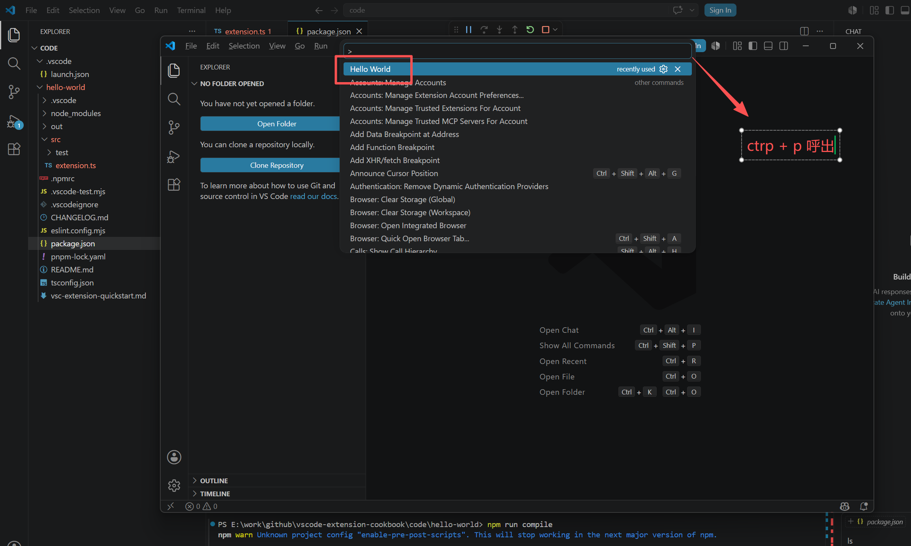
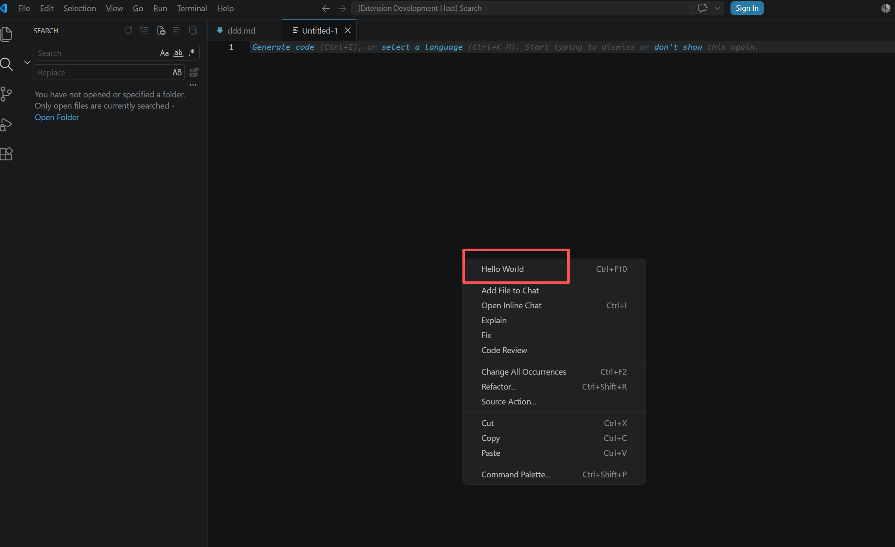

# 命令 Command

> 命令（Command）是扩展与 VS Code 交互的最小单元：扩展把功能注册成命令，然后可以被**命令面板**、**快捷键**、**菜单**、**其他扩展**调用。
> 官方指南：https://code.visualstudio.com/api/extension-guides/command

## 命令的三个组成部分

| 组成                     | 位置                          | 作用                                             |
| ------------------------ | ----------------------------- | ------------------------------------------------ |
| 命令声明                 | `package.json` → `contributes.commands` | 让命令出现在命令面板，并决定是否激活扩展 |
| 命令实现                 | `extension.ts` → `registerCommand`      | 命令真正的业务逻辑                       |
| 命令触发方式             | `contributes.menus` / `contributes.keybindings` | 右键菜单、快捷键、编辑器标题栏等入口 |

> 一个命令 ID（如 `demo1.sayHello`）在 `contributes.commands` 与 `registerCommand` 中必须完全一致。

## package.json 配置

```json
{
	"contributes": {
		// 命令声明：命令面板（Ctrl+Shift+P）中会展示 title
		"commands": [
			{
				"command": "demo1.sayHello",
				"title": "Hello World",
				// 可选：命令面板中的分类，展示为 "分类: 标题"
				"category": "Demo1",
				// 可选：自定义图标（Light/Dark 双主题）
				"icon": {
					"light": "resources/light/icon.svg",
					"dark": "resources/dark/icon.svg"
				},
				// 可选：命令是否可用（false 时命令面板置灰）
				"enablement": "editorLangId == markdown"
			}
		],
		// 快捷键绑定
		"keybindings": [
			{
				"command": "demo1.sayHello",
				"key": "ctrl+f10",
				"mac": "cmd+f10",
				// when 子句决定快捷键在什么上下文生效
				"when": "editorTextFocus"
			}
		],
		// 菜单贡献点
		"menus": {
			"editor/context": [
				{
					"when": "editorFocus",
					"command": "demo1.sayHello",
					"group": "navigation"
				}
			]
		}
	}
}
```

## extension.ts 实现

```typescript
import * as vscode from 'vscode';

// 扩展激活时调用
export function activate(context: vscode.ExtensionContext) {
	// 注册命令  命令 ID 必须与 package.json 中 contributes.commands 的 command 一致
	const disposable = vscode.commands.registerCommand('demo1.sayHello', () => {
		vscode.window.showInformationMessage('Hello World from hello-world Extension!');
	});
	// 注册到上下文，扩展停用时自动释放
	context.subscriptions.push(disposable);
}

// 扩展停用时调用
export function deactivate() {}
```

> 从 VS Code 1.74 开始，`contributes.commands` 会自动生成 `onCommand:` 激活事件，因此 `activationEvents` 可以留空数组 `[]`，不需要再手写 `"onCommand:demo1.sayHello"`。

## 带参数的命令

命令可以接收参数，常用于「右键菜单传入当前文件」这类场景。

```typescript
export function activate(context: vscode.ExtensionContext) {
	// 实现侧：回调参数类型由调用方保证
	context.subscriptions.push(
		vscode.commands.registerCommand('demo1.sayHelloTo', (name?: string) => {
			vscode.window.showInformationMessage(`Hello ${name ?? 'World'}!`);
		})
	);

	// 调用侧：executeCommand 第二个参数开始即为命令参数
	context.subscriptions.push(
		vscode.commands.registerCommand('demo1.sayHelloFromMenu', async (uri?: vscode.Uri) => {
			// 通过 editor/context 菜单触发时，VS Code 会传入被点击资源的 Uri
			const fileName = uri ? vscode.workspace.asRelativePath(uri) : '当前文件';
			await vscode.commands.executeCommand('demo1.sayHelloTo', fileName);
		})
	);
}
```

> `menus` 触发命令时，VS Code 会自动传入上下文参数（例如 `editor/context` 传入资源 `Uri`），无需在 package.json 中声明。

## 文本编辑器命令

需要拿到 `TextEditor` / `TextEditorEdit` 时，使用 `registerTextEditorCommand`，它比 `registerCommand` 更省事（自动补齐编辑器上下文）。

```typescript
export function activate(context: vscode.ExtensionContext) {
	context.subscriptions.push(
		vscode.commands.registerTextEditorCommand('demo1.insertTime', (editor, edit) => {
			// edit 是批量编辑接口，多次 insert/delete 会合并为一次撤销单元
			edit.insert(editor.selection.active, new Date().toLocaleString());
		})
	);
}
```

## 常用 commands API

| API                                                     | 说明                                       |
| ------------------------------------------------------- | ------------------------------------------ |
| `commands.registerCommand(id, callback)`                | 注册命令，返回 `Disposable`                |
| `commands.registerTextEditorCommand(id, callback)`      | 注册需要编辑器上下文的命令                 |
| `commands.executeCommand(id, ...args)`                  | 调用命令（可以是自己的，也可以是内置命令） |
| `commands.getCommands(filterInternal?)`                 | 获取当前所有已注册命令 ID                  |
| `commands.executeCommand('setContext', key, value)`     | 设置 `when` 子句可用的自定义上下文         |

调用内置命令示例：

```typescript
// 调用 VS Code 内置命令，实现打开设置面板
await vscode.commands.executeCommand('workbench.action.openSettings', 'demo3.enumExample');
```

## when 子句上下文

`keybindings` 与 `menus` 中的 `when` 使用同一套上下文键，常用键：

| 上下文键              | 含义                             |
| --------------------- | -------------------------------- |
| `editorFocus`         | 编辑器获得焦点                   |
| `editorTextFocus`     | 编辑器文本区域获得焦点           |
| `editorHasSelection`  | 编辑器中有选中文本               |
| `resourceLangId`      | 当前资源语言，如 `== markdown`   |
| `resourceExtname`     | 当前资源扩展名，如 `== .md`      |

> `setContext` 设置的自定义键也可以直接在 `when` 中使用，实现「命令按状态显示/隐藏」。
> 完整上下文键列表：https://code.visualstudio.com/api/references/when-clause-contexts

## 验证

编译后按 `F5` 进入扩展开发宿主：

1. `Ctrl+Shift+P` 输入命令 `Hello World`，点击执行 → 弹出信息提示框；
2. 在编辑器内按 `Ctrl+F10` → 弹出信息提示框；
3. 在编辑器内右键 → 菜单中可见 `Hello World`（`navigation` 分组）。




## 项目代码
> https://github.com/freewu/vscode-extension-cookbook/tree/main/code/hello-world

## 资料
```markdown
https://code.visualstudio.com/api/extension-guides/command
https://code.visualstudio.com/api/references/contribution-points#contributes.commands
https://code.visualstudio.com/api/references/contribution-points#contributes.menus
https://code.visualstudio.com/api/references/contribution-points#contributes.keybindings
https://code.visualstudio.com/api/references/vscode-api#commands
https://github.com/microsoft/vscode-extension-samples
```
